<h1 class="foo text-shadow-xl">ATProto Can Be As Simple As A WebSocket</h1>

---
layout: image-right
image: ./images/self-portrait.jpg
---

# About Me


- Software Dev for ~10 years
- Developer Advocate at GitKraken
- Twitch Programming Streamer
- Snowboarder


---
layout: image-left
image: ./images/atproto-logo.png

---

# What is the AT Protocol (ATProto)?

## Authenticated Transfer Protocol

Started in 2022

- **Decentralized** - No single point of control
- **Open Source** - Transparent and community-driven
- **Interoperable** - Works across different platforms
- **BlueSky** - The flagship implementation

---
layout: quote
---

<h3 class="color-[var(--slidev-theme-primary)]">From Wikipedia:</h3>

## It is under development by Bluesky Social PBC, a public benefit corporation originally created as an independent research group within Twitter, Inc to investigate the possibility of decentralizing the service.

---
layout: image
---

# Diagram

<div class="w-full h-auto mx-auto  bg-white rounded-lg p-4">
    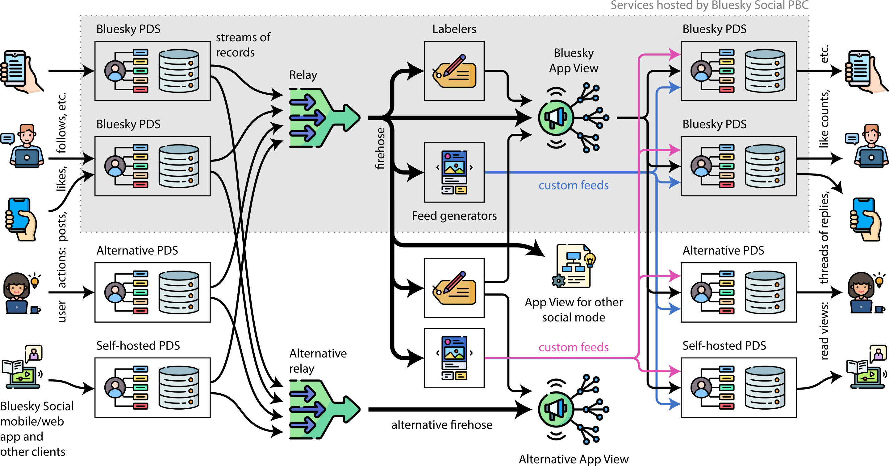
</div>

---

# ATProtocol Platforms (Photo/Video Sharing)

<div class="grid grid-cols-3 gap-8">
    <div>
        
        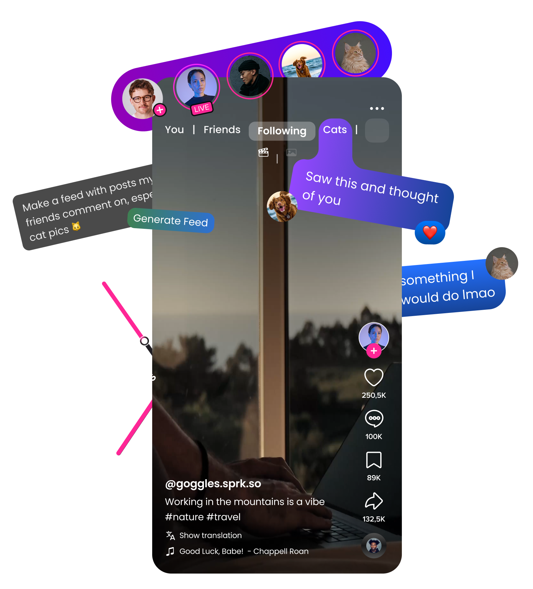
    </div>
    <div>
        
        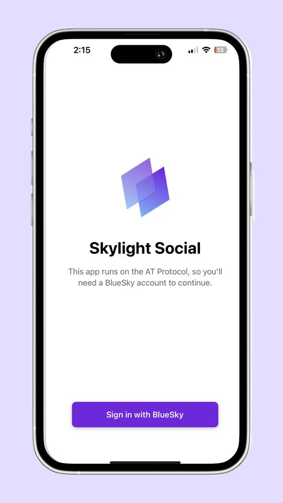
    </div>
    <div>
        
        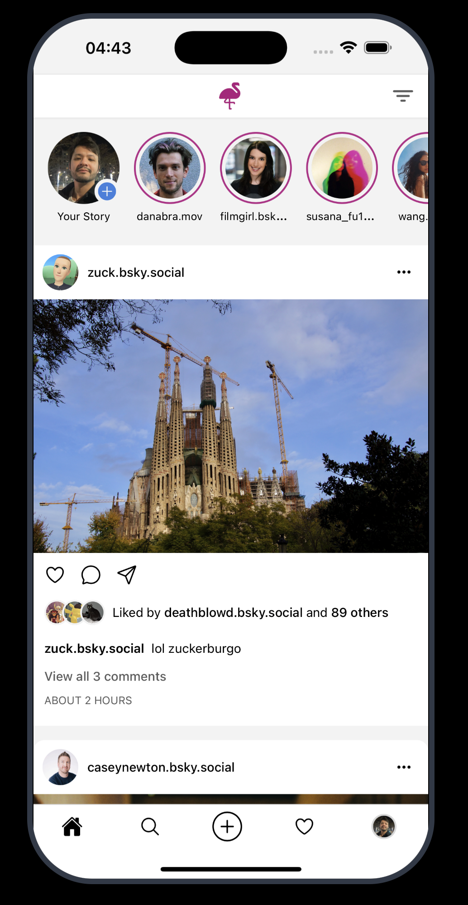
    </div>
</div>


---

# ATProtocol Platforms (Others)

<div class="grid grid-cols-3 gap-8">
    <div>
        <h2>Livestreaming</h2>
        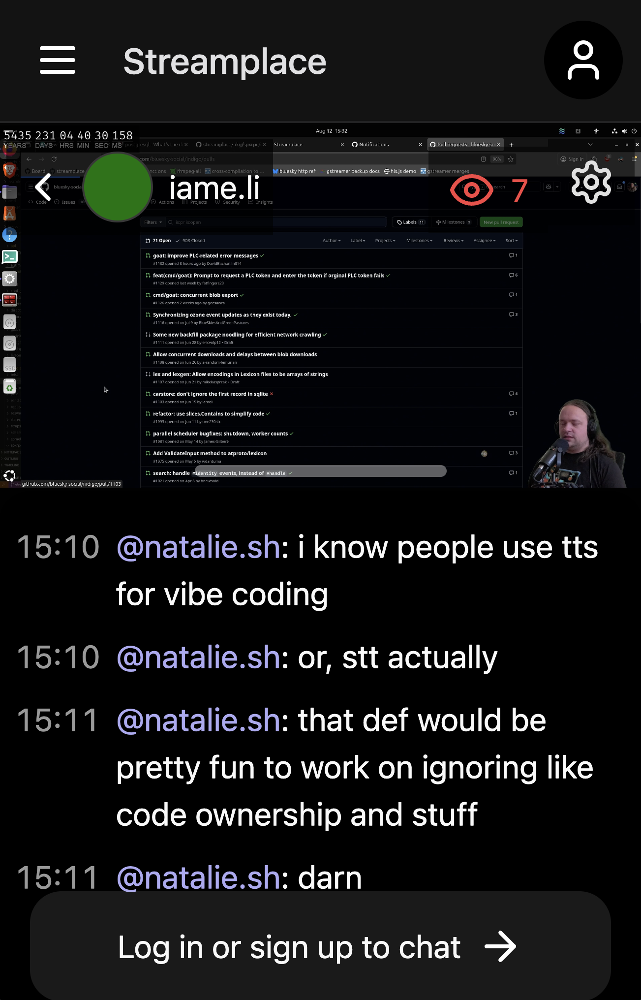
    </div>
    <div>
        <h2>Feed Builders</h2>
        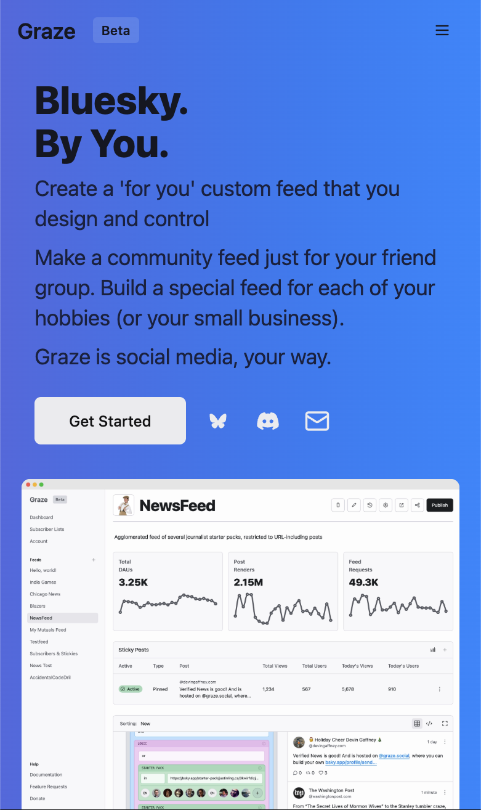
    </div>
    <div>
        <h2>Discord-like</h2>
        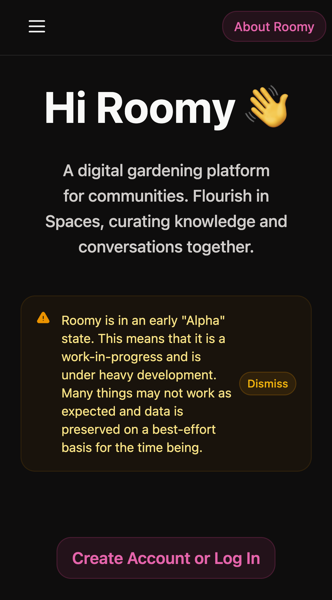
    </div>
</div>

---
layout: fact
---

<div class="px-32">
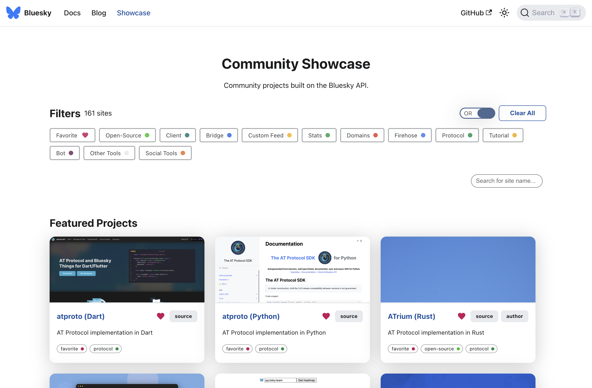
</div>

## https://docs.bsky.app/showcase

---

# Firehose

## Real-time Data Stream

The Firehose provides a real-time stream of all ATProtocol events.

```typescript
import WebSocket from 'ws';
const websocket = new WebSocket(
  "wss://bsky.network/xrpc/com.atproto.sync.subscribeRepos"
);

websocket.onmessage = function (event) {
  const message = JSON.parse(event.data);
  console.log(message);
};

```

---

# Uh Oh...

**DANGER**: There be binary

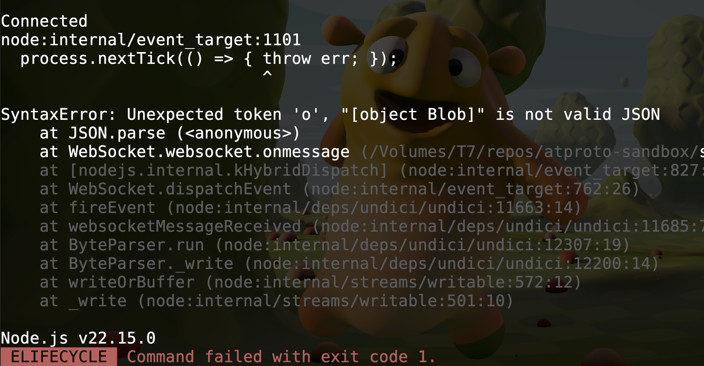

---
layout: image-right
image: ./images/sdks.png
---

# SDKs

Typescript: 
- GitHub: https://github.com/bluesky-social/atproto/tree/main/packages/api
- NPM: https://www.npmjs.com/package/@atproto/api

<div class="mt-20">

```typescript
import { AtpAgent } from '@atproto/api'

const agent = new AtpAgent({
    service: 'https://example.com'
})
```

</div>

---

# Jetstream: A Simpler Firehose

Jetstream provides a more sophisticated streaming interface with filtering capabilities.

<div class="grid grid-cols-2 gap-8 mt-16">
<div>
Self-hostable: <br />
https://github.com/bluesky-social/jetstream

Hosted:
- jetstream1.us-east.bsky.network
- jetstream2.us-east.bsky.network
- jetstream1.us-west.bsky.network
- jetstream2.us-west.bsky.network
</div>
<div>

```typescript
const websocket = new WebSocket(
  // "wss://bsky.network/xrpc/com.atproto.sync.subscribeRepos"
  "wss://jetstream2.us-west.bsky.network/subscribe"
);

websocket.onmessage = function (event) {
  const message = JSON.parse(event.data);
  console.log(message);
};
```
    </div>
</div>

---

<video src="/jetstream.mp4" class="m-[-3.5rem] w-[780px] h-auto mx-auto" autoplay loop controls></video>

---

# The Payload

```json
{
  "did": "did:plc:gdvsrq746v5rtdty5chyok3r",
  "time_us": 1755045653919731,
  "kind": "commit",
  "commit": {
    "rev": "3lwalog26im2e",
    "operation": "create",
    "collection": "app.bsky.feed.post",
    "rkey": "3lwalojlkls2n",
    "record": {
      "$type": "app.bsky.feed.post",
      "createdAt": "2025-08-13T00:40:57.363Z",
      "langs": [
        "en"
      ],
      "text": "I'll take \"Disappointed but not Surprised\" for $400."
    },
    "cid": "bafyreieonmqtikh4jkovhkt6roou7itxwuoydlxmunk6kz36yod754pzke"
  }
}
```

---

# Jetstream Turbo

Made by Graze.social

- Written in Python
- Reduce boilerplate: Clients don’t need to manage their own caching or multiple API calls.
- Low latency: Hydration happens in bulk (up to 100 records at once) and streams immediately.
- Context-rich feeds: Every record includes full profile info, reply chains, and embedded content.

<div class="grid grid-cols-2 gap-8 mt-8">
<div>

Self-hostable: <br />
https://github.com/graze-social/jetstream-turbo

Hosted: <br />
api.graze.social/app/api/v1/turbostream/turbostream

</div>
<div>

```typescript
const websocket = new WebSocket(
  // "wss://bsky.network/xrpc/com.atproto.sync.subscribeRepos"
  // "wss://jetstream2.us-west.bsky.network/subscribe"
  "wss://api.graze.social/app/api/v1/turbostream/turbostream"
);

websocket.onmessage = function (event) {
  const message = JSON.parse(event.data);
  console.log(message);
};
```

</div>
</div>

---

<div max-h-full overflow-y-scroll>

```json
{
  "at_uri": "at://did:plc:lzeiusnn7mxi5wu4ijhhfwk6/app.bsky.feed.post/3lwamju7ul22z",
  "did": "did:plc:lzeiusnn7mxi5wu4ijhhfwk6",
  "time_us": null,
  "message": {
    "did": "did:plc:lzeiusnn7mxi5wu4ijhhfwk6",
    "time_us": 1755046547863002,
    "kind": "commit",
    "commit": {
      "rev": "3lwamj23rjm27",
      "operation": "create",
      "collection": "app.bsky.feed.post",
      "rkey": "3lwamju7ul22z",
      "record": {
        "$type": "app.bsky.feed.post",
        "createdAt": "2025-08-13T00:56:14.479Z",
        "embed": {
          "$type": "app.bsky.embed.video",
          "aspectRatio": {
            "height": 1080,
            "width": 1440
          },
          "video": {
            "$type": "blob",
            "ref": {
              "$link": "bafkreibsa7q237kkotr5yefd56nztxnaf45cw4khrta4t7uhrrnhemidha"
            },
            "mimeType": "video/mp4",
            "size": 3046286
          }
        },
        "facets": [
          {
            "features": [
              {
                "$type": "app.bsky.richtext.facet#tag",
                "tag": "limbuscompany"
              }
            ],
            "index": {
              "byteEnd": 94,
              "byteStart": 80                                                        
            }
          }
        ],
        "langs": [
          "es"
        ],
        "text": "A very niche joke for me and no one else that I had in my head for way too long #limbuscompany"
      },
      "cid": "bafyreibe4nh4qx72ktyhxjscgu7fnn7p6cdgzodygyaijwi6ibral3wycq"
    }                                                                   
  },
  "hydrated_metadata": {                                                             
    "user": {
      "did": "did:plc:lzeiusnn7mxi5wu4ijhhfwk6",
      "handle": "1059kzm.bsky.social",
      "associated": {
        "chat": null,
        "feedgens": 0,
        "labeler": false,
        "lists": 0,
        "starter_packs": 0,
        "py_type": "app.bsky.actor.defs#profileAssociated",
        "activitySubscription": {
          "allowSubscriptions": "followers"
        }
      },
      "avatar": "https://cdn.bsky.app/img/avatar/plain/did:plc:lzeiusnn7mxi5wu4ijhhfwk6/bafkreidnzfuwqlttdaaasmkb77mgrk22rqrdcpfvqnop5osywqpe6mbq3a@jpeg",
      "banner": "https://cdn.bsky.app/img/banner/plain/did:plc:lzeiusnn7mxi5wu4ijhhfwk6/bafkreihsplxgaltpziqiaps7ylldmcf47gu4g3lhry675zwjql6u36gd2i@jpeg",
      "created_at": "2024-10-17T06:35:53.045Z",
      "description": "Ismael, wannabe artist/vsynth cover producer/vocalist, avid enthusiast of vtubers and nü metal, local misoji. EN/ES. Nice to meet you. Header by ippo.tsk, pfp by me",
      "display_name": "icchan",
      "followers_count": 338,
      "follows_count": 373,
      "indexed_at": "2025-08-07T21:28:19.463Z",
      "joined_via_starter_pack": null,
      "labels": [
        {
          "cts": "2024-10-17T06:35:50.991Z",
          "src": "did:plc:lzeiusnn7mxi5wu4ijhhfwk6",
          "uri": "at://did:plc:lzeiusnn7mxi5wu4ijhhfwk6/app.bsky.actor.profile/self",
          "val": "!no-unauthenticated",
          "cid": "bafyreihauruq5gnprwlbrsxlgdbizle2d56dmwjaqws7bbcx4dnw5fk5vy",
          "exp": null,
          "neg": null,
          "sig": null,
          "ver": null,
          "py_type": "com.atproto.label.defs#label"
        }
      ],
      "pinned_post": {
        "cid": "bafyreictyvdyojjlb7wkbufxohj3cnr3mfqwhkc2dpblvgpmcldm3l7ygy",
        "uri": "at://did:plc:lzeiusnn7mxi5wu4ijhhfwk6/app.bsky.feed.post/3lvssgfwo7c26",
        "py_type": "com.atproto.repo.strongRef"
      },
      "posts_count": 4846,
      "verification": null,
      "viewer": {
        "blocked_by": false,
        "blocking": null,
        "blocking_by_list": null,
        "followed_by": null,
        "following": null,
        "known_followers": null,
        "muted": false,
        "muted_by_list": null,
        "py_type": "app.bsky.actor.defs#viewerState"
      },
      "py_type": "app.bsky.actor.defs#profileViewDetailed"
    },
    "mentions": {},
    "parent_post": null,
    "reply_post": null,
    "quote_post": null
  }
}
```

</div>

---

# Documentation

<div class="grid grid-cols-2 gap-8">

<div>
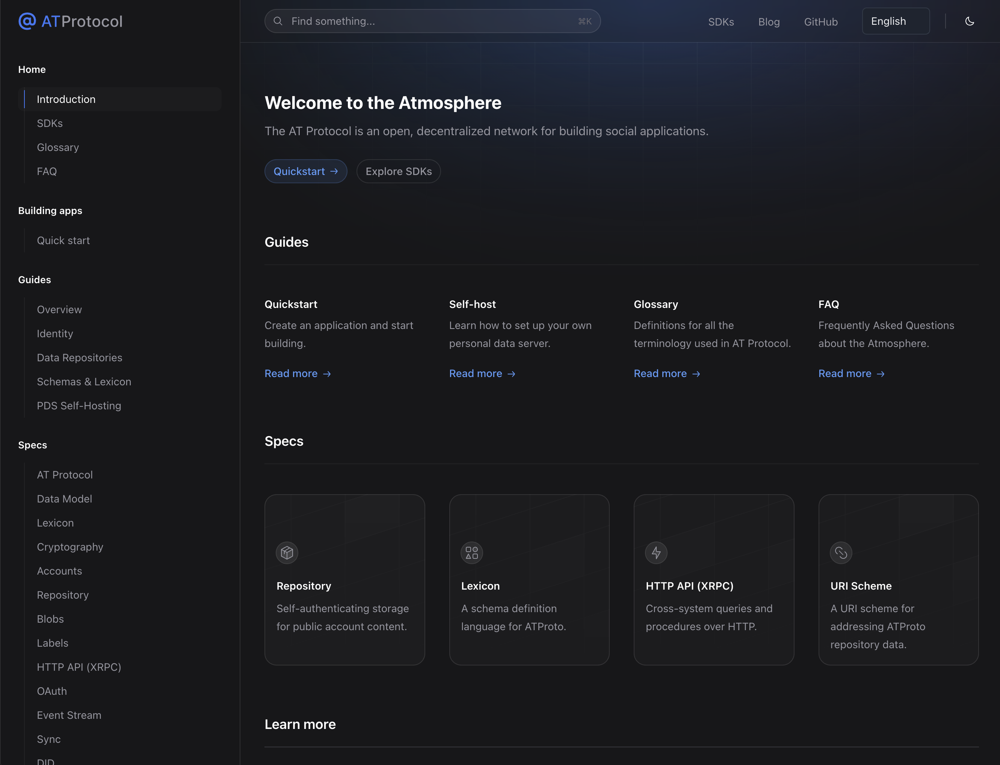
atproto.com
</div>

<div>
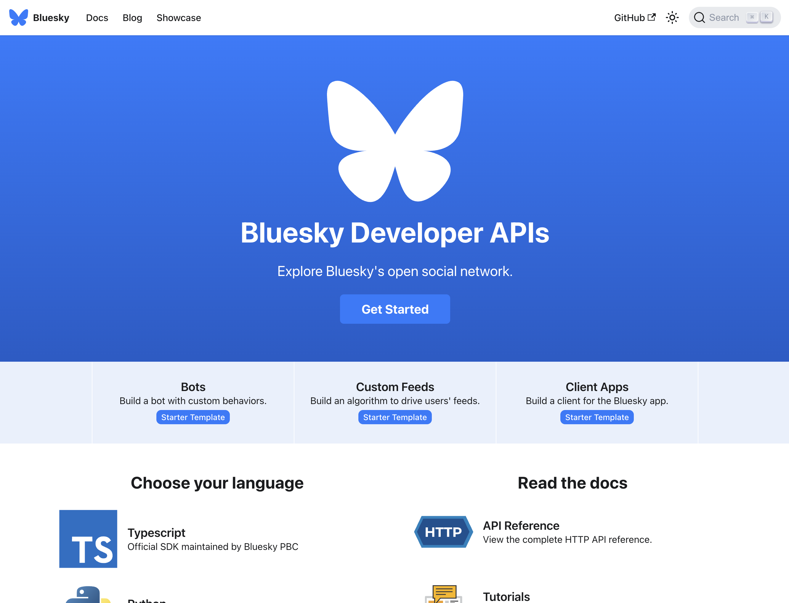
docs.bsky.app
</div>

</div>

---
layout: fact
---

# What are you going to build?

---
layout: end
---

# Thank You!


